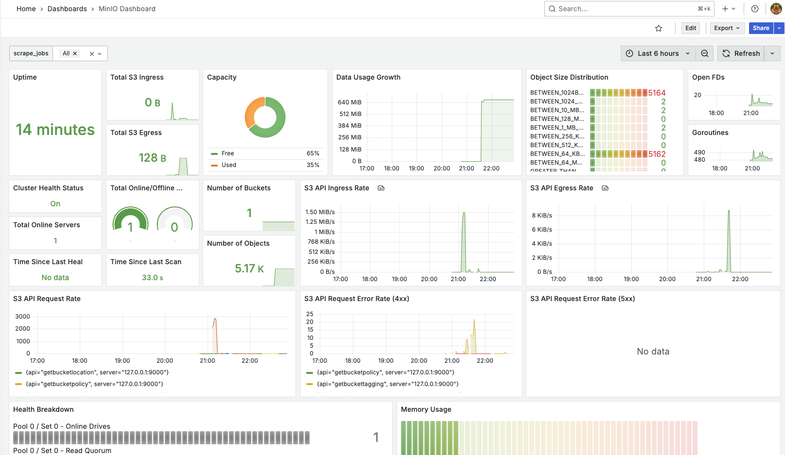

# Video Stream File Processor

A robust file processing system that watches for video files, processes them into chunks, and uploads them to MinIO storage, with comprehensive monitoring and metrics collection.

## Table of Contents

1. [Architecture Overview](docs/architecture.md)
2. [System Components](docs/components.md)
3. [Setup and Installation](docs/setup.md)
4. [Monitoring and Metrics](docs/monitoring.md)
   


## Quick Start

1. Clone the repository:
   ```bash
   git clone <repository-url>
   cd VideoStreamFileProcessor
   ```

2. Install dependencies:
   ```bash
   npm install
   ```

3. Start the services:
   ```bash
   docker-compose up -d
   ```

4. Access the services:
   - Node.js API: http://localhost:3000
   - MinIO Console: http://localhost:9001 (login with minioadmin/minioadmin)
   - Grafana: http://localhost:3001 (login with admin/admin)
   - Prometheus: http://localhost:9090
   - Redis Insights: http://localhost:5540

5. Video Processing:
   - Place any MP4 file in the `test_videos` directory in the project root
   - The system will automatically detect the file, chunk it, and upload it to MinIO
   - Monitor the processing status through the Grafana dashboard

6. Testing with Streaming Video:
   - In one terminal, start the main application:
     ```bash
     npm run start
     ```
   - In another terminal, start the video generator:
     ```bash
     npm run start:generate_video
     ```
   - The generator will create a growing MP4 file that simulates a video stream
   - The main application will automatically detect and process this growing file
   - Monitor the processing in real-time through the Grafana dashboard

## Features

- Directory-based file watching and processing
- Configurable chunk-based file processing
- Efficient storage using MinIO
- Real-time monitoring with Prometheus and Grafana
- Redis-based metadata and status tracking
- Comprehensive metrics collection
- Health check endpoints
- Docker-based deployment

## Technology Stack

- **Backend**: Node.js with TypeScript
- **Storage**: MinIO (S3-compatible)
- **Queue**: Redis
- **Monitoring**: Prometheus + Grafana
- **Containerization**: Docker + Docker Compose
- **Video Metadata**: FFmpeg (for duration extraction only)

For detailed information about each component and how they work together, please refer to the specific documentation sections linked above. 
