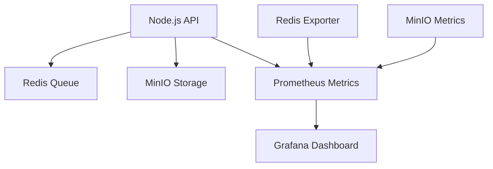

# Architecture Overview

## System Architecture

The Video Stream File Processor is designed as a microservices-based architecture with the following key components:



## Component Interaction

1. **File Processing Flow**
   - Directory watcher monitors for new or modified video files
   - Files are processed in configurable chunks (default 10MB)
   - Each chunk is hashed and uploaded to MinIO
   - Processing status and metadata stored in Redis
   - Stream timeout mechanism (default 30s) to detect file completion

2. **Queue Management**
   - Redis stores stream metadata and chunk information
   - Tracks processing status of each chunk
   - Maintains file-to-stream mapping
   - Enables reliable chunk tracking and recovery

3. **Storage Layer**
   - MinIO provides S3-compatible storage
   - Stores video chunks with metadata
   - Enables efficient chunk retrieval
   - Supports versioning and lifecycle policies

4. **Monitoring Stack**
   - Prometheus collects metrics from all components
   - Grafana visualizes metrics in real-time
   - Redis Exporter provides Redis metrics
   - MinIO exposes built-in metrics

## Data Flow

1. **File Processing Flow**
   ```
   File System → Directory Watcher → Chunk Processing → Redis Metadata → MinIO Storage
   ```

2. **Metrics Flow**
   ```
   Components → Prometheus → Grafana Dashboard
   ```

## Key Features

1. **File Processing**
   - Configurable chunk size (default 10MB)
   - Automatic chunk processing
   - File integrity verification
   - Stream timeout detection

2. **Metadata Management**
   - Stream status tracking
   - Chunk processing status
   - File-to-stream mapping
   - Video duration extraction (via FFmpeg)

3. **Storage**
   - Chunk-based storage
   - S3-compatible interface
   - Metadata preservation
   - Efficient retrieval

## Scalability

The system is designed to scale horizontally:
- Multiple Node.js instances can process files
- Redis queue enables distributed processing
- MinIO supports distributed storage
- Monitoring stack scales with the system

## High Availability

- Redis provides queue redundancy
- MinIO ensures data durability
- Prometheus and Grafana maintain monitoring
- Health checks ensure system reliability

## Security

- **MinIO Authentication**:
  - Root user authentication for MinIO server
  - Access key/secret key authentication for Node.js application
  - Public access for metrics endpoints
  - Console authentication for web interface
- **Redis Security**:
  - Basic network isolation
  - No authentication in development setup
- **Prometheus Metrics**:
  - Public access for metrics endpoints
  - Network isolation via Docker
- **Docker Network Isolation**:
  - Services communicate through Docker network
  - Port exposure limited to necessary endpoints 