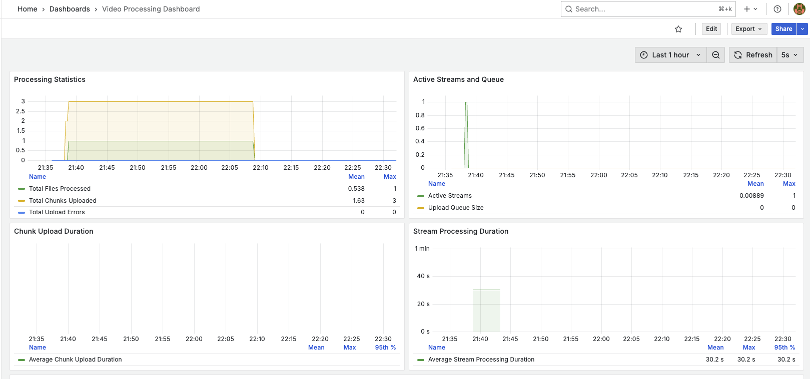
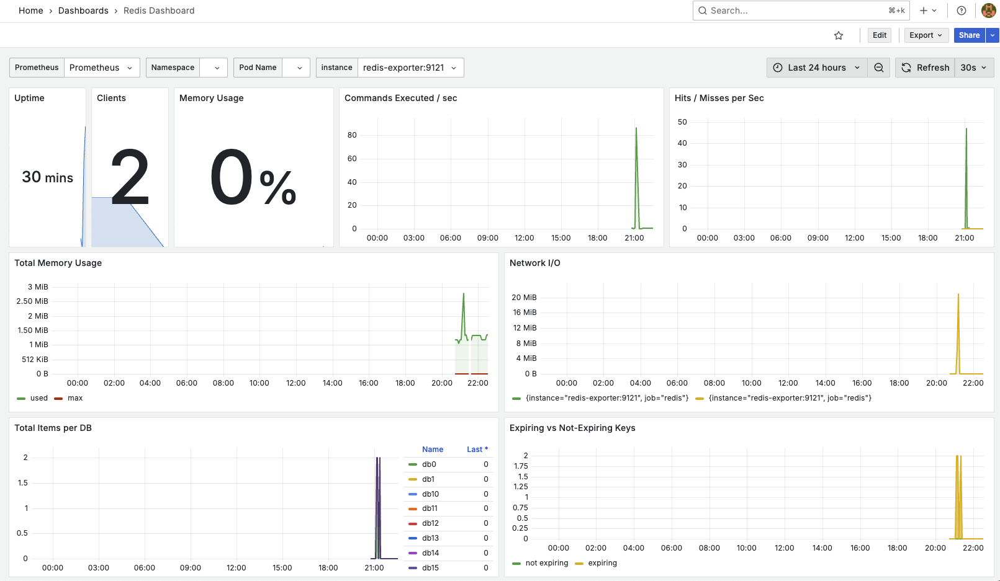

# Monitoring and Metrics

## Overview

The system implements comprehensive monitoring using Prometheus and Grafana, with metrics collected from all major components:

- Node.js Application
- Redis
- MinIO
- System Health

## Metrics Collection

### Node.js Application Metrics

1. **Processing Statistics**
   - `video_files_processed_total`: Total number of video files processed
   - `video_chunks_uploaded_total`: Total number of chunks uploaded to S3
   - `video_upload_errors_total`: Total number of upload errors encountered

2. **Stream Metrics**
   - `video_streams_active`: Number of currently active video streams
   - `video_upload_queue_size`: Number of chunks waiting to be uploaded

3. **Performance Metrics**
   - `video_chunk_upload_duration_seconds`: Time taken to upload a chunk
   - `video_stream_processing_duration_seconds`: Time taken to process a complete video stream
   - `video_storage_used_bytes`: Total storage used for processed videos

### Redis Metrics

Collected via Redis Exporter:
- Memory usage
- Connected clients
- Command statistics
- Key space metrics
- Replication status

### MinIO Metrics

Built-in metrics include:
- Storage usage
- API requests
- Network traffic
- Error rates
- Performance metrics

## Grafana Dashboards

### Video Processing Dashboard

1. **Processing Statistics Panel**
   - Total files processed
   - Total chunks uploaded
   - Total upload errors
   - Trends over time

2. **Active Streams and Queue Panel**
   - Number of active streams
   - Upload queue size
   - System load indicators

3. **Performance Panels**
   - Chunk upload duration
   - Stream processing duration
   - Storage usage

### MinIO Dashboard

1. **Storage Metrics**
   - Total disk usage
   - Available space
   - Usage trends

2. **API Performance**
   - Request rates
   - Error rates
   - Response times

3. **Network Metrics**
   - Traffic received
   - Traffic sent
   - Bandwidth usage

### Redis Dashboard

1. **Memory Usage**
   - Current memory usage
   - Memory limit
   - Usage trends

2. **Client Connections**
   - Active connections
   - Connection rate
   - Client statistics

3. **Command Statistics**
   - Command execution rates
   - Command latency
   - Error rates

## Alerting

The system can be configured to alert on:

1. **Critical Conditions**
   - High error rates
   - Queue size thresholds
   - Storage capacity warnings
   - Processing delays

2. **Performance Issues**
   - Slow upload times
   - High processing duration
   - Memory pressure
   - CPU utilization

## Health Checks

1. **API Health Endpoint**
   - Service status
   - Dependencies status
   - Resource usage

2. **Component Health**
   - Redis connectivity
   - MinIO availability
   - FFmpeg status

## Accessing Metrics

1. **Prometheus**
   - URL: http://localhost:9090
   - Query interface
   - Metric browser
   - Alert manager

2. **Grafana**
   - URL: http://localhost:3001
   - Custom dashboards
   - Metric visualization
   - Alert configuration

## Best Practices

1. **Metric Collection**
   - Regular scraping intervals
   - Appropriate retention periods
   - Efficient query patterns

2. **Dashboard Design**
   - Clear visualization
   - Relevant metrics
   - Proper time ranges
   - Useful aggregations

3. **Alerting**
   - Meaningful thresholds
   - Actionable alerts
   - Proper routing
   - Clear notifications 
